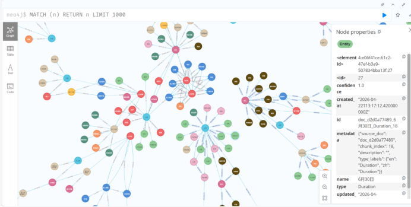
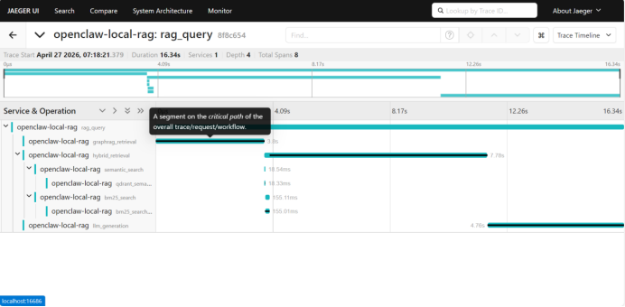
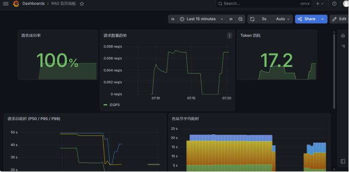

# 🧠 Local RAG 知识库问答系统

> 这是一个生产级 RAG 知识库系统，核心优势在于不做玩具、直接可落地Docker部署——混合检索（语义+BM25）+ GraphRAG 知识图谱 + Cross-Encoder 重排序三路并行，搭配 DeepSeek 大模型生成答案；内置熔断降级重试保障服务稳定性、全链路可观测性（Jaeger + Grafana）让每个环节透明可查，Ragas 自动化流水线确保每次迭代不降级。在垂直领域（如企业制度文档、法律条文、产品手册）中，BM25 能精确命中条款原文，GraphRAG 通过实体关系多跳推理理解制度之间的交叉引用，弥补纯向量检索对高频业务术语和深层关联的盲区，特别适合制度问答、合规审查、知识管理这类需要精准召回和关系推理的场景。

---

## 项目简介

这是一个**生产可用的企业级 RAG 系统**，从零构建，覆盖 RAG 应用的完整生命周期：

1. **文档处理**：基于 Docling 解析 PDF/DOCX/Markdown/TXT → 智能分块 → 向量化存储
2. **混合检索**：语义检索（BGE 向量）+ BM25 关键词检索 → 加权融合结果
3. **重排序**：Cross-Encoder Reranker 对初筛结果二次排序，提升 Top-K 准确率
4. **GraphRAG**：知识图谱（Neo4j）+ 大模型实体提取 → 多跳推理 → 生成关联子图描述
5. **生成**：DeepSeek API + 熔断/降级/重试 → 输出答案
6. **可观测性**：OpenTelemetry Trace（Jaeger）+ Prometheus Metrics + Grafana Dashboard
7. **评测**：Ragas 自动化流水线 + 基线对比

### 核心优势

| 维度 | 说明 |
|------|------|
| 🏗️ **多租户隔离** | 基于 collection 命名空间隔离，Qdrant 向量集合 +
PostgreSQL 权限表实现 |
| ⚡ **高并发架构** | 全异步（asyncio）+ 无阻塞 BM25 管理器 + 独立 GraphRAG 检索器 |
| 📄 **Docling 解析** | 使用 IBM Docling 解析 PDF，支持表格、图片、复杂版面 |
| 🧩 **父块子块** | 分层分块策略（Markdown 标题分割 + RecursiveCharacterTextSplitter） |
| 🎯 **混合检索** | 语义（向量）+ BM25（关键词）加权融合 |
| 📊 **动态阈值** | 基于检索结果统计分布的自适应阈值，拒绝低分文档 |
| 🔄 **重排序** | BGE-Reranker 本地模型 Cross-Encoder 二次排序 |
| 🕸️ **GraphRAG** | 独立于主链路的图检索通道，向量检索 → LLM 提取实体 → Neo4j 多跳 → 子图描述 |
| 📡 **全链路追踪** | Jaeger 可视化每个请求的检索、排序、生成环节耗时 |
| 📈 **Grafana 监控** | 成功率/耗时/QPS/文档数仪表盘 |
| ⛑️ **高可用** | 熔断器（3次失败阈值）+ 降级（文档拼接）+ 重试（指数退避） |
| 🚀 **Docker 部署** | 一键 `docker compose up`，所有服务容器化 |
| 📊 **Ragas 评测** | CI/CD 自动化流水线，faithfulness/recall/precision 基线对比 |

---

## 技术栈

| 分类 | 技术 | 用途 |
|------|------|------|
| 框架 | FastAPI | Web 服务框架 |
| LLM | DeepSeek API | 答案生成、实体提取、文案总结 |
| 嵌入模型 | BGE-small-zh-v1.5 (TEI) | 中文文本向量化 (512维) |
| 向量数据库 | Qdrant | HNSW 向量索引和近似搜索 |
| 关键词检索 | BM25 (jieba分词) | 关键词精确匹配 |
| 重排序 | BGE-Reranker (本地) | Cross-Encoder 二次排序 |
| 知识图谱 | Neo4j 5.20 (社区版) | 实体-关系图存储和遍历 |
| 文档解析 | IBM Docling | PDF/DOCX 版面解析 |
| 分块 | LangChain Text Splitters | 分层分块策略 |
| 缓存 | Redis 7 | 会话缓存、分布式锁 |
| 数据库 | PostgreSQL 15 | 文档元数据、权限策略 |
| 追踪 | OpenTelemetry + Jaeger | 全链路 Span 追踪 |
| 监控 | Prometheus + Grafana | Metrics 采集和仪表盘 |
| 容器化 | Docker + Docker Compose | 镜像构建和编排 |
| 评测 | Ragas | faithfulness / recall / precision |
| CI/CD | GitHub Actions | 自动化构建和评测流水线 |

---

## 项目结构

```
openclaw-local-rag/
├── .github/workflows/       # CI/CD 工作流配置
│   └── evaluate.yml         # Ragas 评测流水线
├── docker/
│   ├── docker-compose.yml   # 多服务容器编排
│   ├── prometheus.yml       # Prometheus 抓取配置
│   └── grafana-dashboard.json  # Grafana 监控面板（预导入）
├── documents/               # 文档挂载目录（映射到容器）
├── logs/                    # 日志挂载目录
├── models/                  # 预下载的离线模型
│   └── reranker/            # BGE-Reranker 重排序模型
├── docling-models/          # Docling 离线版面分析模型
├── huggingface_cache/       # BGE 嵌入模型缓存
├── ragas_test/              # Ragas 评测脚本和数据
├── src/
│   ├── main.py                 # 应用入口
│   ├── api/                    # API 路由和端点
│   ├── core/
│   │   ├── config.py           # 环境配置
│   │   ├── monitoring.py       # 链路追踪和监控埋点
│   │   ├── database.py         # 数据库连接
│   │   ├── task_processor.py   # 异步任务调度
│   │   ├── cache/              # Redis 缓存
│   │   ├── document_processor/ # Docling 文档解析和分块
│   │   ├── embedding/          # BGE 嵌入服务
│   │   ├── graph/              # 知识图谱（独立 GraphRAG、图构建、Neo4j 客户端）
│   │   ├── llm/                # DeepSeek 适配（熔断/降级/重试）
│   │   ├── models/             # 数据库模型
│   │   ├── rag/                # RAG 管道核心（混合检索、BM25、重排序、生成）
│   │   ├── retrieval/          # BM25 和 Cross-Encoder
│   │   ├── storage/            # 持久化存储
│   │   └── vector_db/          # Qdrant 管理器
│   ├── cli/                    # 命令行工具
│   └── core/middleware/        # 日志中间件
├── Dockerfile               # 多阶段构建
├── requirements.txt         # Python 依赖
├── .env                     # 环境变量模板
└── .dockerignore
```

---

## GraphRAG 的设计与定位

### 定位

GraphRAG 是一个**独立的、增强型的检索通道**，不干扰主链路的混合检索。它的作用是**提供实体层面的结构化知识**，弥补纯向量检索在**多跳推理**和**关系理解**上的不足。

### 知识图谱

### 工作流程（4步）

```
用户问题
    │
    ▼
┌────────────────────────────────────────────┐
│  第 1 步：向量检索 top_k=2                  │
│  从 Qdrant 检索最相关的 2 个文档片段         │
│  （只用作实体提取的上下文，不参与最终生成）     │
└────────────────────────────────────────────┘
    │
    ▼
┌────────────────────────────────────────────┐
│  第 2 步：LLM 提取实体                       │
│  从检索到的片段中用 DeepSeek 提取业务实体     │
│  （如 "旷工"、"自动离职"、"工资扣除"）        │
│  过滤掉与问题无关的实体                       │
└────────────────────────────────────────────┘
    │
    ▼
┌────────────────────────────────────────────┐
│  第 3 步：Neo4j 多跳推理（最多 3 跳）         │
│  MATCH (n)-[*1..3]->(m)                     │
│  沿知识图谱遍历，找到关联实体和关系            │
└────────────────────────────────────────────┘
    │
    ▼
┌────────────────────────────────────────────┐
│  第 4 步：生成关联子图描述                    │
│  LLM 将路径聚合为自然语言描述                 │
│  描述直接拼入主提示词                          │
└────────────────────────────────────────────┘
    │
    ▼
┌────────────────────────────────────────────┐
│  最终：混合检索结果 + GraphRAG 描述          │
│  同时送入 DeepSeek 生成答案                  │
└────────────────────────────────────────────┘
```

### 技术要点

- **独立检索器**：`IndependentGraphRAGRetriever` 与主链路的 `HybridRetriever` 完全独立运行，互不影响
- **Neo4j**：Cypher 查询遍历实体关系，最大 3 跳深度，超出自动截断
- **容错**：实体未提取到时跳过 Neo4j 查询，返回空描述，不影响主链路
- **向量检索**：GraphRAG 内部的向量检索仅用于提取实体，不占主链路 quota

---

## 可观测性（Observability）

全链路可观测性是本项目的核心工程特性，覆盖**分布式追踪**（Jaeger）和**聚合监控**（Prometheus + Grafana）两个维度。每个 API 请求经过的检索、排序、图查询、生成环节都有独立的埋点。

### 全链路追踪（Jaeger）

> _

每个 RAG 请求在 Jaeger 中生成如下 span 树：

```
POST /api/v1/qa-hybrid-graphrag/query
├── hybrid_retrieval          ← 混合检索通道
│   ├── semantic_search       ← 语义检索（Qdrant 向量）
│   │   └── qdrant_semantic_search
│   ├── bm25_search           ← BM25 关键词检索
│   │   └── bm25_search_internal
│   └── fuse_results          ← 加权融合
├── rerank                    ← Cross-Encoder 重排序
├── graphrag_retrieval        ← GraphRAG 图检索通道
│   ├── vector_top2           ← 向量检索 top_k=2 片段
│   ├── llm_entity_extraction ← LLM 提取实体
│   ├── neo4j_multi_hop       ← Neo4j 多跳遍历
│   └── subgraph_description  ← 生成子图描述
└── llm_generation            ← DeepSeek 答案生成
```

每条 span 自动记录耗时和状态（`ok` / `error`），你可以在 Jaeger UI 中按 trace ID 搜索、按耗时排序、点击任意 span 查看详情。

**关键用途**：
- 定位瓶颈环节（BM25 比语义检索慢？GraphRAG 超时？）
- 对比不同配置下的性能差异（`use_graphrag=true` vs `false`）
- 诊断异常：哪个环节报错、耗时异常增长
- 查看 DeepSeek API 调用耗时（网络延迟 vs 生成延迟）

### Grafana 监控面板

> 

面板包含以下图表：

| 面板名称 | 数据源 | 说明 |
|---------|--------|------|
| **请求数量趋势** | Prometheus | QPS，区分 `ok` / `error` |
| **请求成功率** | Prometheus | `ok` 请求数 ÷ 总请求数 × 100% |
| **各环节平均耗时** | Prometheus | 仅展示 `graphrag_retrieval`、`hybrid_retrieval`、`llm_generation` 三个关键环节 |
| **最近 10 条请求耗时** | Prometheus | 实时请求耗时走势 |
| **语义检索召回文档数** | Prometheus | `increase(rag_semantic_doc_count_sum[1m])`，最近 1 分钟实际召回片段数 |
| **BM25 检索召回文档数** | Prometheus | `increase(rag_bm25_doc_count_sum[1m])`，最近 1 分钟实际召回片段数 |

**一次正常请求的典型指标值**（基于 50 条测试请求）：
- 混合检索耗时：~0.02s
- GraphRAG 检索耗时：~3.2s（其中 Neo4j 查询 ~2.5s）
- LLM 生成耗时：~2.8s
- 语义召回文档数：12 个
- BM25 召回文档数：24 个（或 0，取决于查询词）

> 导入面板：登录 Grafana (admin/admin) → Dashboards → New → Import → 粘贴 `docker/grafana-dashboard.json`。

---

## 熔断 / 降级 / 重试

系统实现了工业级的 LLM 高可用三件套：

### 熔断器（Circuit Breaker）

```
┌─────────┐     连续失败 3 次     ┌──────┐    30s 后     ┌───────────┐
│  CLOSED │ ──────────────────→  │ OPEN │ ──────────→  │ HALF-OPEN │
│  正常   │                      │ 熔断  │              │  试探请求  │
└─────────┘                      └──────┘              └───────────┘
     ↑                              │                      │    │
     │  record_success()            │  任何请求直接降级      │    │
     │  试探成功                    │                      │    │
     └──────────────────────────────┘                      │    │
                                                            │    │
                          record_failure()                  │    │
                          试探失败 ←────────────────────────┘    │
                                                               │
                          record_success()                      │
                          试探成功 ──────────────────────────────┘
```

### 降级（Degradation）

当熔断器处于 OPEN 状态：
- 所有请求**不调用 DeepSeek API**
- **降级输出**：拼接检索到的前 3 个文档片段，作为最终答案返回
- 降级响应会标注 `[降级响应]` 前缀

### 重试（Retry）

调用 DeepSeek API 时：
- 最大重试次数：3 次
- 429 (Rate Limit)：指数退避（2^attempt 秒）
- 超时/500/异常：间隔 1 秒重试
- 401/403：直接失败，不重试

### 三者协作流程

```
用户请求 → pipeline 检查 _cb_state

[CLOSED]
  → 调 DeepSeek API（含 3 次内部重试）
    → 成功：返回答案
    → 第 3 次重试失败：触发熔断器 OPEN
    → 本次返回降级答案

[OPEN]（0-30s 内）
  → 不调 API → 直接降级返回文档拼接

[HALF-OPEN]（30s 后）
  → 放行一次试探
    → 成功：CLOSED，恢复正常
    → 失败：OPEN，再等 30s
```

---

## 快速开始

### 前置条件

- Docker & Docker Compose (推荐 Docker Desktop 4.25+)
- DeepSeek API 密钥（[platform.deepseek.com](https://platform.deepseek.com)）

### 1. 配置环境变量

```bash
# 复制环境变量模板
cp docker/.env .env

# 编辑 .env，填入你的 DeepSeek API 密钥
# DEEPSEEK_API_KEY=sk-your-key-here
# DEEPSEEK_MODEL=deepseek-chat
# GRAPHRAG_ENABLED=true
```

### 2. 启动所有服务

```bash
# 构建并启动
docker compose -f docker/docker-compose.yml up -d --build

# 查看启动日志
docker logs openclaw-rag-app -f

# 等待服务就绪（BGE 模型加载约需 15-30 秒）
# 看到 "🎉 RAG 系统所有服务初始化完成！" 即就绪
```

### 3. 验证

```bash
# 健康检查
curl http://localhost:8000/health

# 上传文档
curl -X POST http://localhost:8000/api/v1/documents/upload \
  -F "file=@./documents/example.pdf"

# 提问
curl -X POST http://localhost:8000/api/v1/qa-hybrid-graphrag/query \
  -H "Content-Type: application/json" \
  -d '{
    "query": "员工旷工如何处理？",
    "use_graphrag": true,
    "use_rerank": true
  }'

# 获取指标
curl http://localhost:8000/metrics | grep rag_

# 批量提问
curl -X POST http://localhost:8000/api/v1/qa-hybrid-graphrag/batch-query \
  -H "Content-Type: application/json" \
  -d '{
    "queries": ["员工旷工如何处理？", "自动离职的规定有哪些？"]
  }'
```

### 4. 访问监控

| 服务 | 地址 | 说明 |
|------|------|------|
| API Docs | http://localhost:8000/docs | Swagger 文档 |
| Health | http://localhost:8000/health | 健康检查 |
| Metrics | http://localhost:8000/metrics | Prometheus 原始指标 |
| Jaeger UI | http://localhost:16686 | 全链路追踪 |
| Grafana | http://localhost:3000 | 监控面板（admin/admin） |
| Prometheus | http://localhost:9090 | 指标查询 |
| PGAdmin | http://localhost:5050 | 数据库管理 |
| Neo4j Browser | http://localhost:7474 | 知识图谱管理 |
| Qdrant | http://localhost:6333/dashboard | 向量数据库管理 |

---

## 核心实现

### 混合检索（HybridRetriever）

语义检索（向量）+ BM25（关键词）的加权融合：

```python
class HybridRetriever:
    async def retrieve(self, query: RAGQuery) -> List[RetrievedDocument]:
        with span("hybrid_retrieval"):
            # 1. 语义检索
            with span("semantic_search"):
                semantic_results = await self._retrieve_semantic_async(query)

            # 2. BM25 关键词检索
            with span("bm25_search"):
                bm25_results = await self._retrieve_bm25_async(query)

            # 3. 加权融合：semantic × 0.7 + bm25 × 0.3
            with span("fuse_results"):
                fused = self._fuse_results_async(semantic_results, bm25_results)

            return fused
```

- 语义检索权重 0.7，BM25 权重 0.3
- 两种检索独立执行（异步并行），异常互不干扰
- 融合策略：归一化分数加权求和 → 去重 → Top-K

### 重排序（Cross-Encoder Reranker）

使用本地 BGE-Reranker 模型二次排序：

```python
class CrossEncoderReranker:
    def rerank(self, query: str, documents: List[RerankResult]) -> List[RerankResult]:
        # 计算 query-doc 对的 Cross-Encoder 分数
        pairs = [(query, doc.text) for doc in documents]
        scores = self.model(pairs)

        # 混合原始分数 × 0.4 + 重排序分数 × 0.6
        for doc, score in zip(documents, scores):
            doc.rerank_score = score
            doc.hybrid_score = doc.original_score * 0.4 + score * 0.6

        return sorted(documents, key=lambda x: x.hybrid_score, reverse=True)
```

### 监控埋点（OpenTelemetry + Prometheus）

每个环节自动追踪耗时：

```python
from src.core.monitoring import span, record_request

# 在任意函数中埋点
with span("qdrant_semantic_search"):
    results = await qdrant_client.search(...)

# 记录请求结果
record_request(query, total_time, doc_count, token_count)
```

Jaeger 中可看到每个请求的 span 层次：
```
hybrid_retrieval
├── semantic_search
│   └── qdrant_semantic_search
├── bm25_search
│   └── bm25_search_internal
└── fuse_results
```

Grafana 面板指标：
| 指标 | 类型 | 说明 |
|------|------|------|
| `rag_requests_total` | Counter | 请求总数（按 status 区分） |
| `rag_request_duration_seconds` | Histogram | 请求总耗时 |
| `rag_span_duration_seconds` | Histogram | 各环节耗时（按 span 名称） |
| `rag_semantic_doc_count` | Histogram | 语义检索召回文档数 |
| `rag_bm25_doc_count` | Histogram | BM25 检索召回文档数 |
| `rag_token_total` | Counter | Token 消耗总数 |

---

## 容器服务

| 容器 | 基础镜像 | 端口 | 说明 |
|------|----------|------|------|
| openclaw-rag-app | python:3.11 | 8000 | RAG 主应用 |
| postgres | postgres:15-alpine | 5432 | 文档元数据 |
| qdrant | qdrant/qdrant:latest | 6333 | 向量存储 |
| redis | redis:7-alpine | 6379 | 缓存 |
| neo4j | neo4j:5.20-community | 7474/7687 | 知识图谱 |
| tei-bge | ghcr.io/huggingface/text-embeddings-inference:cpu-1.6 | 8080 | BGE 嵌入 |
| prometheus | prom/prometheus:latest | 9090 | 指标存储 |
| jaeger | jaegertracing/all-in-one:latest | 16686 | 链路追踪 |
| grafana | grafana/grafana:latest | 3000 | 仪表盘 |
| pgadmin | dpage/pgadmin4:latest | 5050 | 数据库管理 |

---

## API 端点

### 文档管理

| 方法 | 路径 | 说明 |
|------|------|------|
| POST | `/api/v1/documents/upload` | 上传文档（PDF/DOCX/TXT/MD） |
| GET | `/api/v1/documents/{id}` | 获取文档详情 |
| GET | `/api/v1/documents/list` | 文档列表（分页） |
| DELETE | `/api/v1/documents/{id}` | 删除文档 |
| POST | `/api/v1/documents/search` | 搜索文档 |

### 问答

| 方法 | 路径 | 说明 |
|------|------|------|
| POST | `/api/v1/qa-hybrid-graphrag/query` | 单条问答 |
| POST | `/api/v1/qa-hybrid-graphrag/batch-query` | 批量问答（最多 10 条） |

### 系统

| 方法 | 路径 | 说明 |
|------|------|------|
| GET | `/health` | 健康检查 |
| GET | `/metrics` | Prometheus 指标 |

---

## 评测（Ragas）

### 本地运行

```bash
# 安装评测依赖
pip install instructor openai requests pydantic

# 收集评测样本
python ragas_test/run_evaluation.py collect

# 评测并与基线对比
python ragas_test/run_evaluation.py evaluate --compare ragas_test/baseline_results.json

# 查看结果
cat ragas_test/baseline_results.json
```

### CI/CD 自动评测

每次 push 到 `main` 分支自动触发：

```yaml
# .github/workflows/evaluate.yml
name: RAG 评测
on:
  push:
    branches: [ main ]
  workflow_dispatch:

jobs:
  evaluate:
    runs-on: ubuntu-latest
    steps:
      - uses: actions/checkout@v4
        with:
          lfs: true
      - run: docker build -t openclaw-local-rag:latest .
      - run: docker compose -f docker/docker-compose.yml up -d
      - run: python ragas_test/run_evaluation.py collect
      - run: python ragas_test/run_evaluation.py evaluate --compare ragas_test/baseline_results.json
```

### 基线分数

| 指标 | 分数 | 说明 |
|------|------|------|
| faithfulness | **0.9084** | 答案忠实于上下文 |
| answer_relevancy | **0.9600** | 答案与问题相关 |
| context_recall | **0.8800** | 上下文覆盖了关键信息 |
| context_precision | **0.6535** | 上下文精确匹配问题 |
| answer_correctness | **0.8970** | 答案准确性 |

> 基线基于 50 个样本，包含混合检索 + GraphRAG + 重排序的完整管道。

---

## 常见问题

**Q: BM25 没有召回结果？**
A: BM25 基于分词匹配，查询词过于生僻或不在文档中时召回为 0。主链路日志中搜索 `bm25_results=` 可确认。属于正常行为。

**Q: Grafana 面板显示异常？**
A: 第一次需要手动导入 `docker/grafana-dashboard.json`：登录 Grafana (admin/admin) → `Dashboards` → `New` → `Import` → 粘贴 JSON。

**Q: 容器启动报错 `SyntaxError`？**
A: 本地 `.py` 文件编码需为 UTF-8（无 BOM），Windows 下避免 PowerShell `>` 重定向到容器。

**Q: DeepSeek API 超时？**
A: 熔断器阈值默认 3 次失败，30 秒后自动恢复。可在 `src/core/llm/deepseek_llm.py` 调整 `_CIRCUIT_THRESHOLD` 和 `_CIRCUIT_RECOVERY_SECONDS`。

---
## 注意
重排序模型，docling的解析模型和bge模型由于太大了没上传，可自行去官网下载保存到指定文件下，重排序模型建议用轻量化的或者千问的排序模型挺不错的。

## License

MIT
